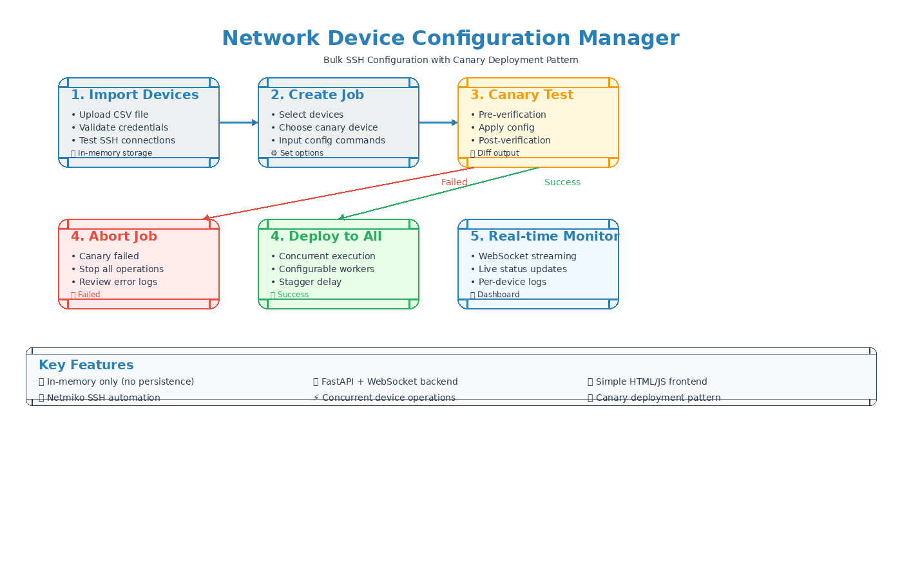

<!--
  Copyright 2026 icecake0141
  SPDX-License-Identifier: Apache-2.0

  Licensed under the Apache License, Version 2.0 (the "License");
  you may not use this file except in compliance with the License.
  You may obtain a copy of the License at

      http://www.apache.org/licenses/LICENSE-2.0

  Unless required by applicable law or agreed to in writing, software
  distributed under the License is distributed on an "AS IS" BASIS,
  WITHOUT WARRANTIES OR CONDITIONS OF ANY KIND, either express or implied.
  See the License for the specific language governing permissions and
  limitations under the License.

  This file was created or modified with the assistance of an AI (Large Language Model).
  Review required for correctness, security, and licensing.
-->
# ネットワークデバイス設定管理ツール

SSH経由で複数のネットワークデバイスに対して複数行の設定コマンドを適用するための、最小限のシングルプロセスWebアプリケーション（MVP）です。

## 🎯 プロジェクト概要

このアプリケーションは、複数のデバイスに対するネットワーク機器設定を同時に管理するためのシンプルなWebベースのインターフェースを提供します。主な機能：

- **カナリアデプロイメントパターン**: 全デバイスへの展開前にカナリアデバイスで設定をテスト
- **リアルタイム監視**: WebSocketベースのライブログストリーミングとステータス更新
- **変更前後の検証**: 変更前後のデバイス状態をキャプチャして差分表示
- **並行実行**: スタガー遅延を伴う設定可能な並行処理
- **エラーハンドリング**: 接続エラーの自動リトライ、エラー時停止機能

### ワークフロー概要



上記の図は、デバイスのインポートから展開までの完全なワークフローを示しており、安全な設定変更を保証するカナリアデプロイメントパターンも含まれています。

## ⚠️ セキュリティに関する注意

**重要**: このアプリケーションはデバイス認証情報を平文で扱い、プロセスメモリにのみ保存します。

- CSVファイルには平文のパスワードが含まれます
- すべてのデータは一時的 - 永続的なストレージはありません
- アプリケーションは実行時に認証情報をメモリに保持します
- 再起動すると、すべてのデータが失われます
- **信頼できる隔離されたネットワークでのみ使用してください**
- **追加のセキュリティ対策なしには本番環境に適していません**

## 🚀 クイックスタート

### 前提条件

- Docker および Docker Compose
- Python 3.11+（ローカル開発用）
- SSH経由でアクセス可能なネットワークデバイス（またはテスト用のモックSSHサーバー）

### Docker Composeで実行

```bash
# リポジトリのクローン
git clone https://github.com/icecake0141/nw-edit.git
cd nw-edit

# すべてのサービスを起動
docker-compose up -d

# アプリケーションにアクセス
# フロントエンド: http://localhost:3000
# バックエンドAPI: http://localhost:8000
# APIドキュメント: http://localhost:8000/docs
```

### ローカル実行（開発用）

```bash
# バックエンドの依存関係をインストール
cd backend
pip install -r requirements-dev.txt

# バックエンドを起動
uvicorn app.main:app --reload --host 0.0.0.0 --port 8000

# 別のターミナルでフロントエンドを提供
cd frontend/public
python -m http.server 3000

# http://localhost:3000 でアクセス
```

## 📋 CSV形式

アプリケーションは以下の形式のCSVを介してデバイスをインポートします：

```csv
host,port,device_type,username,password,name,verify_cmds
192.168.1.1,22,cisco_ios,admin,password123,Router1,show running-config | section snmp
192.168.1.2,22,cisco_ios,admin,password123,Router2,show ip interface brief
10.0.0.1,2222,cisco_ios,admin,password,Switch1,
```

### カラムの説明

| カラム | 必須 | 説明 | デフォルト |
|--------|------|------|------------|
| `host` | はい | IPアドレスまたはホスト名 | - |
| `port` | いいえ | SSHポート | 22 |
| `device_type` | はい | Netmikoデバイスタイプ（例: cisco_ios, cisco_nxos） | - |
| `username` | はい | SSHユーザー名 | - |
| `password` | はい | SSHパスワード | - |
| `name` | いいえ | デバイスの名前（任意） | - |
| `verify_cmds` | いいえ | セミコロン区切りの検証コマンド | - |

### サンプルCSV

```csv
host,port,device_type,username,password,name,verify_cmds
192.168.1.1,22,cisco_ios,admin,cisco123,Core-Router,show running-config | section snmp;show ip interface brief
192.168.1.2,22,cisco_ios,admin,cisco123,Access-Switch,show vlan brief
```

## 📸 ユーザーインターフェース

### 1. デバイスインポート画面


CSV内容を貼り付けてデバイスをインポートし検証します。アプリケーションは各デバイスに対して軽量な接続テスト（認証のみ）を実行します。

### 2. ジョブ作成画面


- 設定するデバイスを選択
- 1つのカナリアデバイスを指定
- 設定コマンドを入力
- 検証コマンドを設定
- 並行性とエラーハンドリングオプションを設定

### 3. ジョブ監視画面


リアルタイム監視機能：
- デバイスごとのステータスカード
- ライブログストリーミング
- 設定の変更前後の差分
- エラーレポート
- 実行中ジョブの一時停止・再開・終了ボタン（Docker環境でも利用可能）

## 🔌 APIドキュメント

### POST /api/devices/import

CSVからデバイスをインポートして検証します。

**リクエスト**:
```
Content-Type: text/plain

host,port,device_type,username,password,name,verify_cmds
192.168.1.1,22,cisco_ios,admin,password123,Router1,show run
```

**レスポンス**:
```json
{
  "devices": [
    {
      "host": "192.168.1.1",
      "port": 22,
      "device_type": "cisco_ios",
      "username": "admin",
      "password": "password123",
      "name": "Router1",
      "verify_cmds": ["show run"],
      "connection_ok": true,
      "error_message": null
    }
  ]
}
```

### GET /api/devices

インポートされたすべてのデバイスを取得します。

**レスポンス**: デバイスオブジェクトの配列。

### POST /api/jobs

設定ジョブを作成して実行します。

**リクエスト**:
```json
{
  "job_name": "SNMP設定の更新",
  "creator": "admin",
  "devices": [],
  "canary": {
    "host": "192.168.1.1",
    "port": 22
  },
  "commands": "snmp-server community public RO\nsnmp-server location DataCenter1",
  "verify_only": "canary",
  "verify_cmds": ["show running-config | section snmp"],
  "concurrency_limit": 5,
  "stagger_delay": 1.0,
  "stop_on_error": true
}
```

**レスポンス**:
```json
{
  "job_id": "550e8400-e29b-41d4-a716-446655440000",
  "status": "queued"
}
```

### POST /api/jobs/{job_id}/pause

実行中のジョブを一時停止します。再開するまで新しいデバイスには実行されません。

**レスポンス**:
```json
{
  "job_id": "550e8400-e29b-41d4-a716-446655440000",
  "status": "paused"
}
```

### POST /api/jobs/{job_id}/resume

一時停止中のジョブを再開します。

**レスポンス**:
```json
{
  "job_id": "550e8400-e29b-41d4-a716-446655440000",
  "status": "running"
}
```

### POST /api/jobs/{job_id}/terminate

実行中のジョブを終了し、未処理デバイスをキャンセルします。実行中のデバイスは安全な区切りで停止を試みます。

**レスポンス**:
```json
{
  "job_id": "550e8400-e29b-41d4-a716-446655440000",
  "status": "cancelled"
}
```

### GET /api/jobs/{job_id}

ジョブのステータスと結果を取得します。

### WebSocket /ws/jobs/{job_id}

リアルタイムジョブ更新。

**メッセージタイプ**:

```json
{"type": "log", "job_id": "...", "device": "host:port", "phase": "pre|apply|post", "data": "ログ行"}
{"type": "device_status", "job_id": "...", "device": "host:port", "status": "queued|running|success|failed", "error": null}
{"type": "job_complete", "job_id": "...", "status": "completed|failed|cancelled"}
```

## 🧪 テスト

### ユニットテストの実行

```bash
cd backend
pip install -r requirements-dev.txt
pytest tests/unit -v
```

### インテグレーションテストの実行

```bash
# モックSSHサーバーを起動
docker-compose up -d mock-ssh

# インテグレーションテストを実行
pytest tests/integration -v -m integration

# クリーンアップ
docker-compose down
```

### カバレッジ付きですべてのテストを実行

```bash
pytest -v --cov=backend/app --cov-report=html
```

## 🔧 CI/CD

このプロジェクトには、以下を実行するGitHub Actionsワークフローが含まれています：

1. **Lint**: Pythonコードに対して`black`と`flake8`を実行
2. **Test**: カバレッジレポート付きでユニットテストを実行
3. **Build**: Dockerイメージをビルドして検証
4. **Integration**: モックSSHサーバーに対してインテグレーションテストを実行

ワークフローファイル: `.github/workflows/ci.yml`

### CIをローカルで実行

```bash
# Lint
cd backend
black app/ ../tests/
flake8 app/ ../tests/ --max-line-length=120 --extend-ignore=E203,W503

# Test
pytest tests/unit -v --cov=backend/app

# Build
docker build -t nw-edit:latest .

# Integration
docker-compose up -d mock-ssh
pytest tests/integration -v -m integration
docker-compose down
```

## 📐 アーキテクチャ

### コンポーネント

- **バックエンド**: FastAPIアプリケーション（Python 3.11+）
  - `app/main.py`: FastAPIアプリケーションとAPIエンドポイント
  - `app/models.py`: データ検証用のPydanticモデル
  - `app/ssh_executor.py`: NetmikoベースのSSH操作
  - `app/job_manager.py`: インメモリジョブオーケストレーション
  - `app/ws.py`: WebSocketハンドラー

- **フロントエンド**: シンプルなHTML/JavaScript SPA
  - `frontend/public/index.html`: メインUI
  - `frontend/public/app.js`: アプリケーションロジックとWebSocketクライアント

- **モックSSHサーバー**: テスト用のAsyncSSHベースのモックデバイス
  - `tests/mock_ssh_server/server.py`: モックSSHサーバーの実装

### 実行フロー

1. **デバイスインポート**: CSV → 解析 → 接続検証 → メモリに保存
2. **ジョブ作成**: 入力を検証 → ジョブを作成 → 実行スレッドを開始
3. **カナリア実行**: 接続 → 事前検証 → 設定適用 → 事後検証 → 差分
4. **カナリア成功時**: 残りのデバイスを並行実行
5. **リアルタイム更新**: WebSocket経由でログとステータスをストリーミング

### 並行処理モデル

- **ThreadPoolExecutor**: 並行SSHセッションを管理
- **最大ワーカー数**: 設定可能（デフォルト: 5）
- **スタガー遅延**: タスク送信間の遅延（デフォルト: 1秒）
- **リトライロジック**: 接続エラーを1回リトライ（非カナリアのみ）

### タイムアウト

- **接続**: 10秒
- **コマンド**: 20秒（設定可能10-30秒）
- **デバイス合計**: 180秒

### エラーハンドリング

- **カナリア失敗**: ジョブ全体を即座に中止
- **非カナリア失敗**: 
  - `stop_on_error=true`の場合: 新しいタスクのスケジュールを停止、実行中のタスクは完了させる
  - `stop_on_error=false`の場合: 残りのデバイスで続行

## 🎛️ 設定

### 環境変数

| 変数 | 説明 | デフォルト |
|------|------|------------|
| `ADMIN_PASSWORD` | 基本認証用のオプションの管理者パスワード | なし |

### ジョブパラメータ

| パラメータ | 説明 | デフォルト |
|-----------|------|------------|
| `concurrency_limit` | 最大並行デバイス操作数 | 5 |
| `stagger_delay` | タスク開始間の遅延（秒） | 1.0 |
| `stop_on_error` | 最初のエラーで停止 | true |
| `verify_only` | 検証のみモードを実行 | "canary" |

## ⚙️ サポートされているデバイスタイプ

このアプリケーションはNetmikoを使用し、すべてのNetmikoデバイスタイプをサポートしています：

- `cisco_ios` - Cisco IOS
- `cisco_xe` - Cisco IOS XE
- `cisco_nxos` - Cisco NX-OS
- `cisco_asa` - Cisco ASA
- `arista_eos` - Arista EOS
- `juniper_junos` - Juniper Junos
- その他多数（[Netmikoドキュメント](https://github.com/ktbyers/netmiko)を参照）

## 🚫 制限事項

- **永続化なし**: すべてのデータはインメモリ。再起動するとすべてクリアされます。
- **ロールバックなし**: 失敗時の自動ロールバックはありません。
- **ファイルダウンロードなし**: 事前/事後の出力は表示のみ、ダウンロード不可。
- **パスワードマスキングなし**: ログはコマンドをそのまま表示（機密データのマスキングなし）。
- **シングルプロセス**: 水平方向にスケーラブルではありません。
- **認証なし**: 最小限または認証なし（本番環境用に独自に追加してください）。
- **ログサイズ制限**: デバイスごとのログは1MiBに制限。

## 🤝 貢献

1. リポジトリをフォーク
2. 機能ブランチを作成
3. 変更を加える
4. テストとリンティングを実行
5. プルリクエストを送信

## 📄 ライセンス

このプロジェクトは教育および内部使用のために提供されています。

## 🔗 リンク

- [Netmikoドキュメント](https://github.com/ktbyers/netmiko)
- [FastAPIドキュメント](https://fastapi.tiangolo.com/)
- [English README](README.md)
