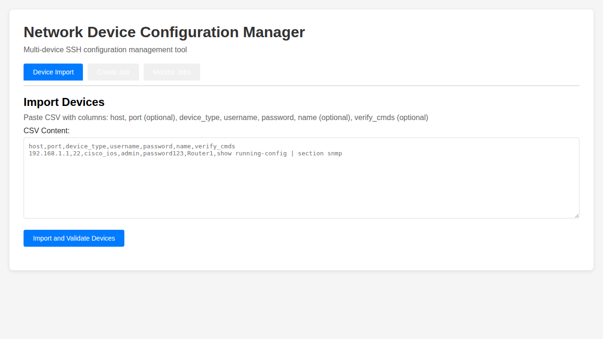
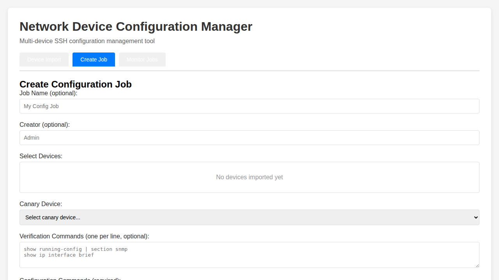
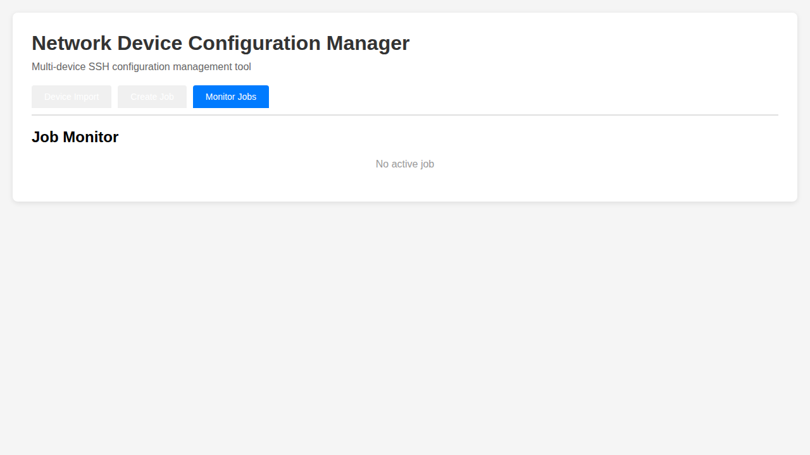

# Network Device Configuration Manager

A minimal single-process web application (MVP) for applying multi-line configuration commands to multiple network devices over SSH.

## 🎯 Project Overview

This application provides a simple, web-based interface for managing network device configurations across multiple devices simultaneously. It features:

- **Canary deployment pattern**: Test configuration on a canary device before rolling out to all devices
- **Real-time monitoring**: WebSocket-based live log streaming and status updates
- **Pre/post verification**: Capture and diff device state before and after changes
- **Concurrent execution**: Configurable concurrency with stagger delays
- **Error handling**: Automatic retry on connection errors, stop-on-error capability

## ⚠️ Security Notice

**IMPORTANT**: This application handles device credentials in plaintext and stores them in process memory only. 

- CSV files contain plaintext passwords
- All data is ephemeral - no persistent storage
- Application keeps credentials in memory during runtime
- On restart, all data is lost
- **Use only in trusted, isolated networks**
- **Not suitable for production without additional security measures**

## 🚀 Quick Start

### Prerequisites

- Docker and Docker Compose
- Python 3.11+ (for local development)
- Network devices accessible via SSH (or use mock SSH server for testing)

### Run with Docker Compose

```bash
# Clone the repository
git clone https://github.com/icecake0141/nw-edit.git
cd nw-edit

# Start all services
docker-compose up -d

# Access the application
# Frontend: http://localhost:3000
# Backend API: http://localhost:8000
# API Docs: http://localhost:8000/docs
```

### Run Locally (Development)

```bash
# Install backend dependencies
cd backend
pip install -r requirements-dev.txt

# Start the backend
uvicorn app.main:app --reload --host 0.0.0.0 --port 8000

# In another terminal, serve the frontend
cd frontend/public
python -m http.server 3000

# Access at http://localhost:3000
```

## 📋 CSV Format

The application imports devices via CSV with the following format:

```csv
host,port,device_type,username,password,name,verify_cmds
192.168.1.1,22,cisco_ios,admin,password123,Router1,show running-config | section snmp
192.168.1.2,22,cisco_ios,admin,password123,Router2,show ip interface brief
10.0.0.1,2222,cisco_ios,admin,password,Switch1,
```

### Column Descriptions

| Column | Required | Description | Default |
|--------|----------|-------------|---------|
| `host` | Yes | IP address or hostname | - |
| `port` | No | SSH port | 22 |
| `device_type` | Yes | Netmiko device type (e.g., cisco_ios, cisco_nxos) | - |
| `username` | Yes | SSH username | - |
| `password` | Yes | SSH password | - |
| `name` | No | Friendly device name | - |
| `verify_cmds` | No | Semicolon-separated verification commands | - |

### Sample CSV

```csv
host,port,device_type,username,password,name,verify_cmds
192.168.1.1,22,cisco_ios,admin,cisco123,Core-Router,show running-config | section snmp;show ip interface brief
192.168.1.2,22,cisco_ios,admin,cisco123,Access-Switch,show vlan brief
```

## 📸 User Interface

### 1. Device Import Screen



Paste CSV content to import and validate devices. The application performs a lightweight connection test (authentication only) for each device.

### 2. Job Create Screen



- Select devices to configure
- Designate one canary device
- Enter configuration commands
- Configure verification commands
- Set concurrency and error handling options

### 3. Job Monitor Screen



Real-time monitoring with:
- Per-device status cards
- Live log streaming
- Pre/post configuration diffs
- Error reporting

## 🔌 API Documentation

### POST /api/devices/import

Import and validate devices from CSV.

**Request**:
```
Content-Type: text/plain

host,port,device_type,username,password,name,verify_cmds
192.168.1.1,22,cisco_ios,admin,password123,Router1,show run
```

**Response**:
```json
{
  "devices": [
    {
      "host": "192.168.1.1",
      "port": 22,
      "device_type": "cisco_ios",
      "username": "admin",
      "password": "password123",
      "name": "Router1",
      "verify_cmds": ["show run"],
      "connection_ok": true,
      "error_message": null
    }
  ]
}
```

### GET /api/devices

Get all imported devices.

**Response**: Array of device objects.

### POST /api/jobs

Create and execute a configuration job.

**Request**:
```json
{
  "job_name": "Update SNMP Config",
  "creator": "admin",
  "devices": [],
  "canary": {
    "host": "192.168.1.1",
    "port": 22
  },
  "commands": "snmp-server community public RO\nsnmp-server location DataCenter1",
  "verify_only": "canary",
  "verify_cmds": ["show running-config | section snmp"],
  "concurrency_limit": 5,
  "stagger_delay": 1.0,
  "stop_on_error": true
}
```

**Response**:
```json
{
  "job_id": "550e8400-e29b-41d4-a716-446655440000",
  "status": "queued"
}
```

### GET /api/jobs/{job_id}

Get job status and results.

### WebSocket /ws/jobs/{job_id}

Real-time job updates.

**Message Types**:

```json
{"type": "log", "job_id": "...", "device": "host:port", "phase": "pre|apply|post", "data": "log line"}
{"type": "device_status", "job_id": "...", "device": "host:port", "status": "queued|running|success|failed", "error": null}
{"type": "job_complete", "job_id": "...", "status": "completed|failed|cancelled"}
```

## 🧪 Testing

### Run Unit Tests

```bash
cd backend
pip install -r requirements-dev.txt
pytest tests/unit -v
```

### Run Integration Tests

```bash
# Start mock SSH server
docker-compose up -d mock-ssh

# Run integration tests
pytest tests/integration -v -m integration

# Cleanup
docker-compose down
```

### Run All Tests with Coverage

```bash
pytest -v --cov=backend/app --cov-report=html
```

## 🔧 CI/CD

The project includes a GitHub Actions workflow that:

1. **Lint**: Runs `black` and `flake8` on Python code
2. **Test**: Executes unit tests with coverage reporting
3. **Build**: Builds Docker image and validates
4. **Integration**: Runs integration tests against mock SSH server

Workflow file: `.github/workflows/ci.yml`

### Running CI Locally

```bash
# Lint
cd backend
black app/ ../tests/
flake8 app/ ../tests/ --max-line-length=120 --extend-ignore=E203,W503

# Test
pytest tests/unit -v --cov=backend/app

# Build
docker build -t nw-edit:latest .

# Integration
docker-compose up -d mock-ssh
pytest tests/integration -v -m integration
docker-compose down
```

## 📐 Architecture

### Components

- **Backend**: FastAPI application (Python 3.11+)
  - `app/main.py`: FastAPI application and API endpoints
  - `app/models.py`: Pydantic models for data validation
  - `app/ssh_executor.py`: Netmiko-based SSH operations
  - `app/job_manager.py`: In-memory job orchestration
  - `app/ws.py`: WebSocket handlers

- **Frontend**: Simple HTML/JavaScript SPA
  - `frontend/public/index.html`: Main UI
  - `frontend/public/app.js`: Application logic and WebSocket client

- **Mock SSH Server**: AsyncSSH-based mock device for testing
  - `tests/mock_ssh_server/server.py`: Mock SSH server implementation

### Execution Flow

1. **Device Import**: CSV → Parse → Validate connection → Store in memory
2. **Job Creation**: Validate inputs → Create job → Start execution thread
3. **Canary Execution**: Connect → Pre-verify → Apply config → Post-verify → Diff
4. **If Canary Success**: Execute remaining devices concurrently
5. **Real-time Updates**: Stream logs and status via WebSocket

### Concurrency Model

- **ThreadPoolExecutor**: Manages concurrent SSH sessions
- **Max Workers**: Configurable (default: 5)
- **Stagger Delay**: Delay between task submissions (default: 1s)
- **Retry Logic**: Connection errors retried once (non-canary only)

### Timeouts

- **Connection**: 10 seconds
- **Command**: 20 seconds (configurable 10-30s)
- **Device Total**: 180 seconds

### Error Handling

- **Canary Failure**: Immediately abort entire job
- **Non-Canary Failure**: 
  - If `stop_on_error=true`: Stop scheduling new tasks, let running tasks finish
  - If `stop_on_error=false`: Continue with remaining devices

## 🎛️ Configuration

### Environment Variables

| Variable | Description | Default |
|----------|-------------|---------|
| `ADMIN_PASSWORD` | Optional admin password for basic auth | None |

### Job Parameters

| Parameter | Description | Default |
|-----------|-------------|---------|
| `concurrency_limit` | Max concurrent device operations | 5 |
| `stagger_delay` | Delay between task starts (seconds) | 1.0 |
| `stop_on_error` | Stop on first error | true |
| `verify_only` | Run verify-only mode | "canary" |

## ⚙️ Supported Device Types

The application uses Netmiko and supports all Netmiko device types:

- `cisco_ios` - Cisco IOS
- `cisco_xe` - Cisco IOS XE
- `cisco_nxos` - Cisco NX-OS
- `cisco_asa` - Cisco ASA
- `arista_eos` - Arista EOS
- `juniper_junos` - Juniper Junos
- And many more (see [Netmiko documentation](https://github.com/ktbyers/netmiko))

## 🚫 Limitations

- **No Persistence**: All data is in-memory. Restarting clears everything.
- **No Rollback**: No automatic rollback on failures.
- **No File Download**: Pre/post outputs are view-only, not downloadable.
- **No Password Masking**: Logs show commands as-is (no sensitive data masking).
- **Single Process**: Not horizontally scalable.
- **No Authentication**: Minimal or no authentication (add your own for production).
- **Log Size Limit**: Per-device logs limited to 1 MiB.

## 🤝 Contributing

1. Fork the repository
2. Create a feature branch
3. Make your changes
4. Run tests and linting
5. Submit a pull request

## 📄 License

This project is provided as-is for educational and internal use.

## 🔗 Links

- [Netmiko Documentation](https://github.com/ktbyers/netmiko)
- [FastAPI Documentation](https://fastapi.tiangolo.com/)
- [Japanese README](README.ja.md)
